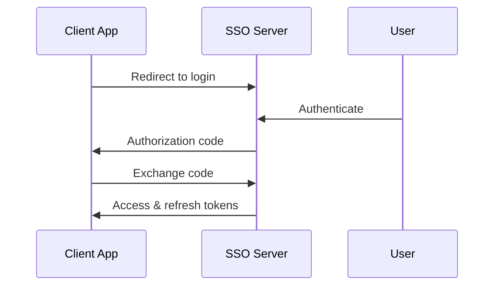

<h1> u-SSO  </h1>
Single Sign-On (SSO) server using Express.js and OIDC

 

## Wth is even this ?

A lightweight SSO (server yet the client side) built with Express.js that implements OpenID Connect standards. Enables centralized authentication across multiple applications  

## Key Features

### Authentication & Authorization
- OpenID Connect (OIDC) compliant flows
- JWT-based access & refresh tokens  
- Cross-domain SSO sessions
- Secure token exchange & validation

### Integration
- Easy client application registration
- RESTful API endpoints
- MongoDB persistence
- Configurable session policies

### Security
- HTTPS/TLS support
- CSRF protection
- Rate limiting
- Token encryption

## Core Flow

### Ressources :
- Learn more about **sso**  : https://www.onelogin.com/fr-fr/learn/how-single-sign-on-works

- Tool to handle **saml** : https://www.samltool.com

